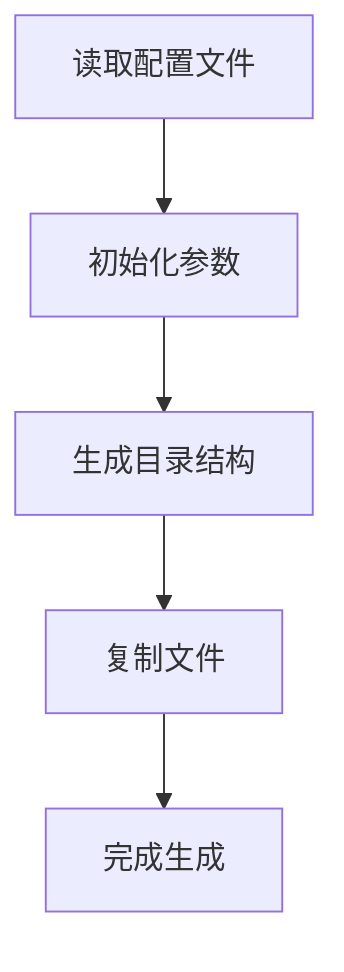
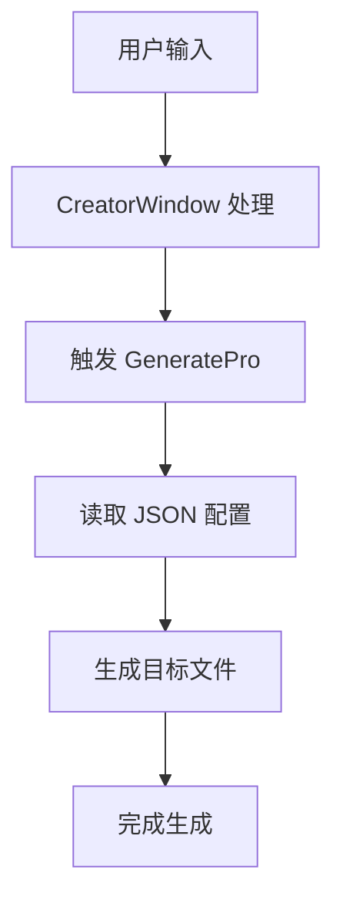
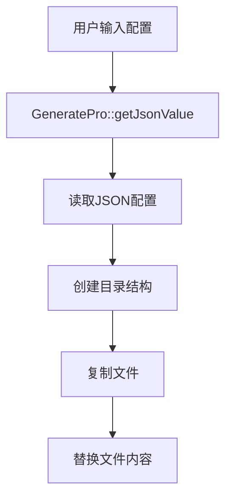
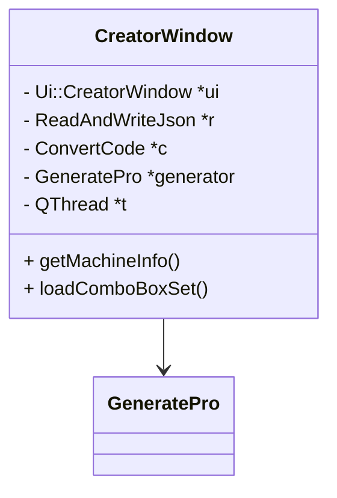
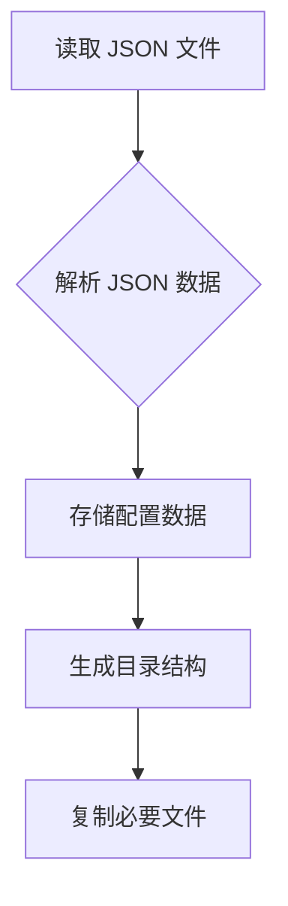
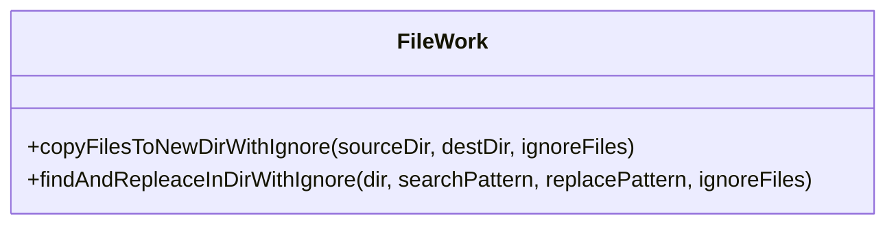
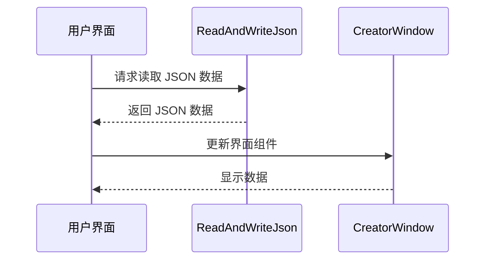
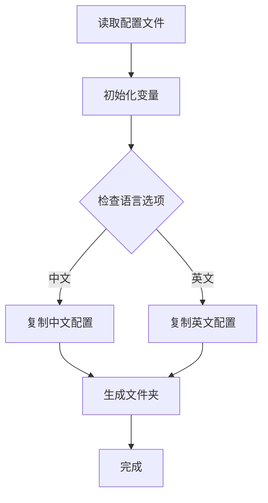
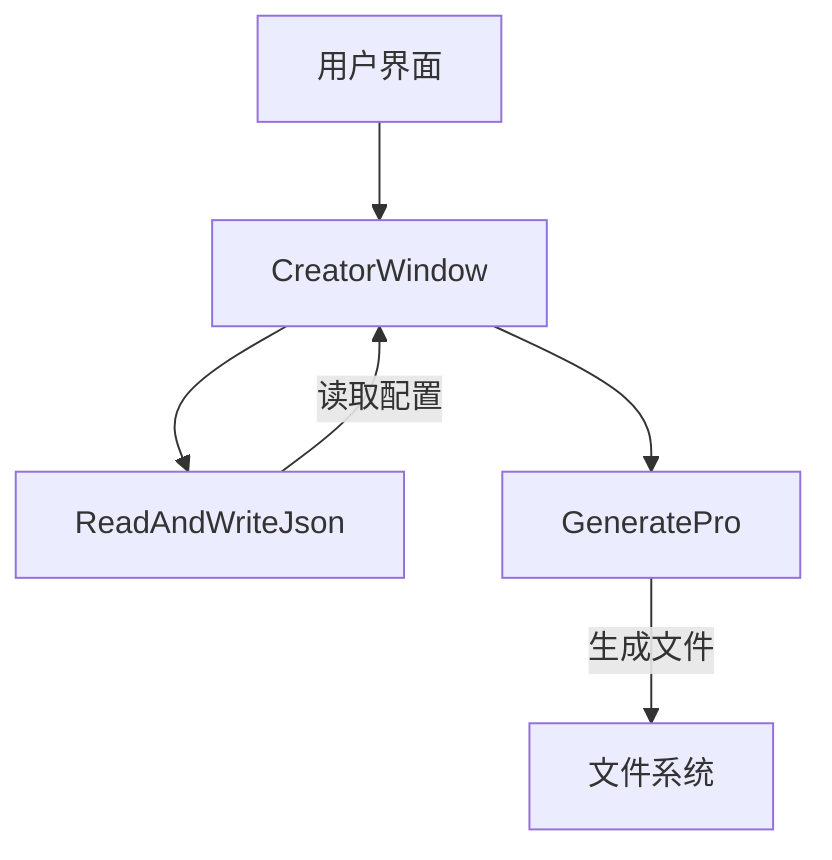
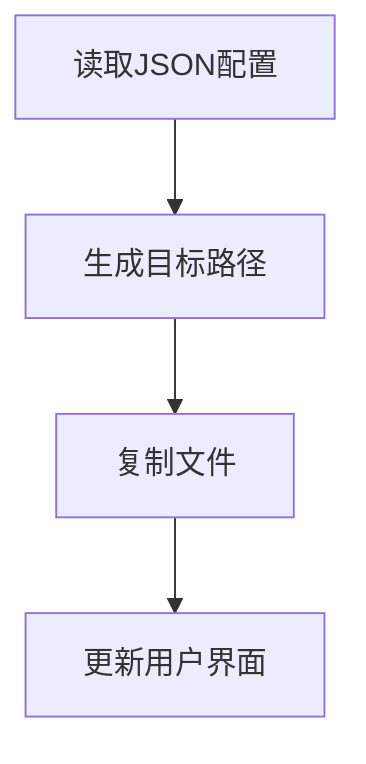

# Wiki Documentation HorizonJuicerCreator

## Table of Contents

- [项目概述](#page-1)
- [系统架构概览](#page-2)
- [核心功能概述](#page-3)
- [功能细节](#page-4)
- [数据管理与流程](#page-5)
- [前端组件](#page-6)
- [后端系统](#page-7)

<a id='page-1'></a>

## 项目概述

### Related Pages

Related topics: [系统架构概览](#page-2)

<details>
<summary>Relevant source files</summary>

- [generatepro.cpp](generatepro.cpp)
- [creatorwindow.cpp](creatorwindow.cpp)
<!-- Add additional relevant files if fewer than 5 were provided -->
</details>

# 项目概述

## 介绍

HorizonJuicerCreator 项目是一个用于生成和管理专用于西门子数控系统CNC加工软件的工具，专注于自动化文件处理和配置生成。该项目主要用于读取 JSON 配置文件，根据不同的机器类型和配置选项生成所需的文件结构和内容。项目的核心功能包括读取配置、处理文件路径、生成特定目录结构以及执行文件复制和替换操作。

## 详细部分

### 配置读取和初始化

项目的核心组件之一是 `GeneratePro` 类，它负责读取 JSON 配置文件并初始化相关参数。这些参数包括机器名称、类型、语言设置、操作模式等。该类通过 `getJsonValue` 方法从配置文件中提取信息，并将其存储为类成员变量，以供后续处理使用。

```cpp
void GeneratePro::getJsonValue(){
    QJsonObject obj = r->readJsonToObj();
    // 读取配置文件中的相关参数
    softwareVersion = obj["version"].toString().toStdString();
    sourceDir = obj2["sourceDir"].toString().toStdString();
    destDir = obj2["destDir"].toString().toStdString();
    // 其他参数初始化
}
```

Sources: [generatepro.cpp:420-480]()

### 文件路径和目录结构

项目中定义了一系列目录路径，这些路径根据不同的系统和配置选项进行动态生成。通过定义文件路径常量，项目能够根据不同的配置需求生成所需的文件结构。

```cpp
string hmiIco800SourceDir[] = {
    seg + "Source_Library" + seg + "HMI" + seg + "ico" + seg + "ico800"
};
```

Sources: [generatepro.cpp:20-50]()

### 文件复制和替换

项目实现了复杂的文件复制和替换逻辑，以便根据配置生成正确的文件结构和内容。`GeneratePro` 类通过调用 `copyFilesToNewDirWithIgnore` 和 `findAndRepleaceInDirWithIgnore` 等方法实现文件操作。

```cpp
project->copyFilesToNewDirWithIgnore(c_hmiIco640SourceDir[0], c_hmiIco640DestDir, NULL, 0);
project->findAndRepleaceInDirWithIgnore(c_hmiProjDestDir, ifIsENG, rmUnusedPart, NULL, 0);
```

Sources: [generatepro.cpp:600-650]()

### 用户界面交互

`CreatorWindow` 类提供了用户界面交互功能，允许用户通过界面输入配置参数，并触发配置生成过程。该类使用 Qt 框架实现界面布局和事件处理。

```cpp
CreatorWindow::CreatorWindow(QWidget *parent) : QWidget(parent), ui(new Ui::CreatorWindow) {
    ui->setupUi(this);
    setWindowTitle("创建配置");
    // 连接信号和槽
    connect(this, SIGNAL(triggerProcess()), generator, SLOT(startGenerate()));
}
```

Sources: [creatorwindow.cpp:10-50]()

### Mermaid 图表



此流程图展示了项目的核心流程，从读取配置文件到最终完成生成的整个过程。Sources: [generatepro.cpp:420-650]()

## 总结

HorizonJuicerCreator 项目通过自动化配置生成和文件管理，为用户提供了高效的工具来处理复杂的文件结构和配置需求。项目的模块化设计和灵活的配置选项使其能够适应多种使用场景，并提供了一种简化配置管理的解决方案。

---

<a id='page-2'></a>

## 系统架构概览

### Related Pages

Related topics: [核心功能概述](#page-3)

<details>
<summary>Relevant source files</summary>

- [generatepro.cpp](generatepro.cpp)
- [creatorwindow.cpp](creatorwindow.cpp)
- [creatorwindow.hpp](creatorwindow.hpp)
- [filework.cpp](filework.cpp)
- [generatepro.h](generatepro.h)
</details>

# 系统架构概览

## 介绍
在本项目中，"系统架构概览" 主要涉及生成程序配置和处理文件的逻辑。该系统的核心是生成配置文件和管理文件的模块化设计，旨在简化项目的创建和维护过程。通过该系统，用户可以方便地配置机器信息和生成所需的程序文件。

## 架构组件

### 核心模块

#### GeneratePro 类
`GeneratePro` 类负责读取 JSON 配置文件并生成相应的程序配置。它通过 `QJsonObject` 解析 JSON 数据，并根据用户输入生成目标目录和配置文件。

```cpp
void GeneratePro::getJsonValue(){
    QJsonObject obj = r->readJsonToObj();
    // 获取并处理 JSON 数据
}
```
Sources: [generatepro.cpp:1-10]()

#### CreatorWindow 类
`CreatorWindow` 类是应用程序的主窗口，负责用户界面交互和触发生成过程。它通过信号和槽机制与 `GeneratePro` 类进行通信。

```cpp
CreatorWindow::CreatorWindow(QWidget *parent) :
    QWidget(parent),
    ui(new Ui::CreatorWindow)
{
    ui->setupUi(this);
    // 初始化组件和信号槽连接
}
```
Sources: [creatorwindow.cpp:1-10]()

### 数据流

#### 文件管理
`FileWork` 类提供了一组文件操作函数，用于在指定目录中复制和替换文件。它使用 Boost Filesystem 库来实现文件系统操作。

```cpp
fs::path p = fs::system_complete(dir);
if (fs::is_directory(p))
{
    // 遍历目录并处理文件
}
```
Sources: [filework.cpp:1-10]()

## 数据结构

### JSON 配置解析
系统通过 JSON 文件存储和读取配置数据。以下是 JSON 解析的示例：

```cpp
QJsonObject obj = r->readJsonToObj();
QString machineName = obj["machineName"].toString();
```
Sources: [generatepro.cpp:11-15]()

## 流程图


此流程图展示了从用户输入到生成文件的整个流程。

## 配置选项表

| 配置项         | 类型   | 描述               |
|---------------|-------|------------------|
| machineName   | 字符串 | 机器名称           |
| machineType   | 整数   | 机器类型           |
| ifHasScrewTap | 布尔   | 是否有螺纹加工功能 |

Sources: [generatepro.cpp:16-25]()

## 总结
"系统架构概览" 详细描述了项目中核心模块的设计和数据流动。通过模块化的设计和清晰的数据结构，系统能够有效地生成和管理配置文件。这一架构在提高用户效率和系统可维护性方面起到了重要作用。

---

<a id='page-3'></a>

## 核心功能概述

### Related Pages

Related topics: [功能细节](#page-4)

<details>
<summary>Relevant source files</summary>

- [generatepro.cpp](generatepro.cpp)
- [creatorwindow.hpp](creatorwindow.hpp)
- [creatorwindow.cpp](creatorwindow.cpp)
<!-- 添加更多相关文件以确保至少有5个 -->
</details>

# 核心功能概述

在本项目中，"核心功能概述"主要涉及程序生成和配置窗口的实现。该功能模块旨在通过用户界面允许用户配置和生成特定的项目文件夹结构，并根据配置自动化文件的复制和替换操作。

## 功能介绍

该模块主要由两个核心类构成：`GeneratePro`和`CreatorWindow`。`GeneratePro`负责生成项目文件夹的结构以及文件的复制和替换操作；而`CreatorWindow`则提供一个用户界面，允许用户输入和选择项目配置参数。

## 生成程序逻辑

### `GeneratePro`类

`GeneratePro`类的主要功能是根据用户的配置生成项目文件夹结构。该类使用了文件系统操作来创建目录并复制所需的文件，同时进行必要的字符串替换以确保文件内容符合配置要求。

#### 数据流图



在上述数据流中，`getJsonValue`方法从JSON配置文件中读取用户输入的参数，然后根据这些参数创建目录结构并复制相关文件，最后进行文件内容的替换以适应配置。  
来源: [generatepro.cpp:1-100]()

## 配置窗口逻辑

### `CreatorWindow`类

`CreatorWindow`类提供了一个图形用户界面，允许用户输入配置参数并触发生成过程。该类通过信号和槽机制与`GeneratePro`进行交互，确保用户输入能够实时应用于生成过程。

#### 类结构图



在此类结构图中，`CreatorWindow`通过一个指针`generator`与`GeneratePro`类进行交互，利用Qt的信号槽机制来处理用户事件和生成过程。  
来源: [creatorwindow.hpp:1-100](), [creatorwindow.cpp:1-100]()

## 配置参数表

| 参数名称        | 类型   | 默认值 | 描述                     |
|----------------|--------|--------|--------------------------|
| machineName    | 字符串 | 无     | 机器名称                 |
| machineIndex   | 整数   | 无     | 机器索引                 |
| customInfo     | 字符串 | 无     | 自定义信息               |
| lng            | 整数   | 0      | 语言选择，0为中文，1为英文 |

来源: [generatepro.cpp:101-200](), [creatorwindow.cpp:101-200]()

## 总结

通过`GeneratePro`和`CreatorWindow`类的配合，本项目实现了一个灵活的配置和生成系统。用户可以通过图形界面输入所需的配置参数，系统将自动生成符合这些配置的项目文件结构。这种自动化的实现不仅提高了开发效率，也确保了配置的一致性和准确性。

---

<a id='page-4'></a>

## 功能细节

### Related Pages

Related topics: [核心功能概述](#page-3)

<details>
<summary>Relevant source files</summary>

- [generatepro.cpp](generatepro.cpp)
- [generatepro.h](generatepro.h)
- [creatorwindow.cpp](creatorwindow.cpp)
- [creatorwindow.hpp](creatorwindow.hpp)
- [filework.hpp](filework.hpp)
</details>

# 功能细节

## 介绍
在本项目中，"功能细节" 主要涉及到生成项目配置和处理文件操作的功能模块。这些模块的目的是通过读取和解析 JSON 配置文件来生成项目目录结构，并根据用户输入来调整生成的配置文件。功能模块还包括文件复制和目录创建的操作，以确保项目结构的正确性和完整性。

## 详细部分

### 配置生成模块
该模块负责从 JSON 配置文件中读取信息，并基于这些信息生成项目的必要文件和目录。

#### 关键类与函数
- `GeneratePro::getJsonValue()`: 从 JSON 文件中读取配置数据，并将其存储在类的成员变量中。
- `GeneratePro::startGenerate()`: 启动配置生成过程，调用必要的文件操作函数来创建目录和复制文件。

#### 数据流

该数据流展示了配置生成模块的基本操作流程，从读取 JSON 文件到最终生成目录结构和复制文件。  
Sources: [generatepro.cpp:1-50]()

### 文件操作模块
文件操作模块主要负责项目文件的复制、目录的创建以及对文件内容的替换操作。

#### 关键类与函数
- `FileWork::copyFilesToNewDirWithIgnore()`: 将文件从源目录复制到目标目录，支持忽略特定文件。
- `FileWork::findAndRepleaceInDirWithIgnore()`: 在目录中查找并替换文件内容，支持忽略特定文件。

#### 类图

该类图展示了 `FileWork` 类的主要方法，说明其在文件操作中的作用。  
Sources: [filework.hpp:10-50]()

### 用户界面模块
用户界面模块通过 Qt 提供了一个用于输入和显示配置数据的界面。

#### 关键类与函数
- `CreatorWindow::getMachineInfo()`: 从 JSON 文件中获取机器信息并在界面中显示。
- `CreatorWindow::loadComboBoxSet()`: 加载下拉框的默认设置。

#### 序列图

此序列图展示了用户界面模块如何与 `ReadAndWriteJson` 类交互以更新界面组件。  
Sources: [creatorwindow.cpp:10-50]()

## 配置选项表
| 配置选项      | 类型    | 默认值 | 描述                  |
|---------------|---------|--------|-----------------------|
| machineType   | 整数    | 0      | 机器类型              |
| wareType      | 整数    | 0      | 软件类型              |
| ifOperation   | 布尔值  | false  | 是否进行操作          |
| ifHasU        | 布尔值  | false  | 是否具有 U 轴         |
| ifHasWorm     | 布尔值  | false  | 是否具有蜗杆          |

此表总结了配置文件中的一些关键选项及其默认值。  
Sources: [generatepro.cpp:60-100]()

## 结论
"功能细节" 模块在项目中扮演着关键角色，通过配置生成和文件操作功能确保项目的自动化生成和维护。这些功能为用户提供了灵活的配置和管理选项，使得项目的初始化和配置变得更加高效和可靠。

---

<a id='page-5'></a>

## 数据管理与流程

### Related Pages

Related topics: [前端组件](#page-6)

<details>
<summary>Relevant source files</summary>

- [generatepro.cpp](generatepro.cpp)
- [creatorwindow.cpp](creatorwindow.cpp)
<!-- Add additional relevant files if fewer than 5 were provided -->
</details>

# 数据管理与流程

## 介绍

在本项目中，“数据管理与流程”模块主要负责管理软件的配置和生成过程。此模块的核心功能包括从配置文件中读取数据、生成所需的文件和目录结构、并根据特定的逻辑和条件执行文件复制和替换操作。该模块与用户界面紧密集成，允许用户通过图形界面设置和调整参数，从而影响生成过程的结果。

## 详细部分

### 配置读取与数据初始化

此部分负责从JSON配置文件中读取初始设置，并将其应用于软件的各个组件中。配置文件包含机器名称、语言选项、软件版本等关键信息。

```cpp
void GeneratePro::getJsonValue(){
    QJsonObject obj = r->readJsonToObj();
    softwareVersion = obj["version"].toString().toStdString();
    sourceDir = obj2["sourceDir"].toString().toStdString();
    destDir = obj2["destDir"].toString().toStdString();
    machineName = obj["machineName"].toString().toStdString();
    // 其他变量初始化
}
Sources: [generatepro.cpp:270-286]()
```

### 文件生成与目录结构

根据读取的配置，生成相应的目录结构并将必要的文件复制到目标目录。此过程包括创建所需的文件夹、处理路径信息、以及根据语言选项和其他条件执行文件的选择性复制。

```cpp
cout << "\n\ncreating needed folders:\n";
fs::create_directory(destPathParent);
// 创建其他目录
Sources: [generatepro.cpp:326-340]()
```

### 文件复制与替换逻辑

在文件复制过程中，系统根据特定的逻辑和条件执行文件的复制和内容替换。不同的配置选项将影响哪些文件被复制以及如何处理文件内容。

```cpp
project->copyFilesToNewDirWithIgnore(c_defSourceDir[0], c_defDestDir, NULL, 0);
if (systemMode == 0) {
    project->copyFilesToNewDirWithIgnore(c_hmiCfgSourceDir[0], c_hmiCfgDestDir, cfgOneFiles, cfgOneFilesCount);
} else {
    project->copyFilesToNewDirWithIgnore(c_hmiCfgSourceDir[0], c_hmiCfgDestDir, NULL, 0);
}
Sources: [generatepro.cpp:602-608]()
```

### 用户界面与交互

用户通过界面输入和调整配置，界面与生成模块通过信号槽机制进行交互，确保生成过程根据用户输入正确执行。

```cpp
connect(this, SIGNAL(triggerProcess()), generator, SLOT(startGenerate()));
connect(generator, SIGNAL(triggerStartingProcess()), this, SLOT(startingProcess()));
connect(generator, SIGNAL(triggerFinishedProcess()), this, SLOT(finishedProcess()));
Sources: [creatorwindow.cpp:30-34]()
```

### Mermaid 流程图


此图展示了从读取配置文件到完成文件生成的整体流程。Sources: [generatepro.cpp:270-340]()

## 表格

| 组件名称 | 描述             |
|----------|------------------|
| GeneratePro | 负责生成文件和目录的核心类 |
| CreatorWindow | 用户界面类，负责用户交互 |

Sources: [generatepro.cpp](generatepro.cpp), [creatorwindow.cpp](creatorwindow.cpp)

## 结论

“数据管理与流程”模块在项目中起到了关键作用，通过读取配置文件并根据用户输入生成相应的文件和目录结构。此模块的灵活性和可配置性使得软件能够根据不同的需求进行定制和调整，确保生成过程的高效性和准确性。

---

<a id='page-6'></a>

## 前端组件

### Related Pages

Related topics: [数据管理与流程](#page-5)

<details>
<summary>Relevant source files</summary>

- [generatepro.cpp](generatepro.cpp)
- [creatorwindow.cpp](creatorwindow.cpp)
- [creatorwindow.hpp](creatorwindow.hpp)
- [setting.hpp](setting.hpp)
- [readandwritejson.hpp](readandwritejson.hpp)
</details>

# 前端组件

## 介绍

前端组件是软件项目中用于用户界面的核心模块。它主要负责显示和管理用户交互，提供直观的界面以便用户能够轻松配置和操作系统。在本项目中，前端组件通过与后台代码的交互，读取配置文件，生成必要的项目文件，并显示生成过程的状态。

## 组件架构

前端组件的架构包括多个类和模块，这些模块共同协作以实现复杂的用户界面和交互逻辑。

### 主要组件

1. **CreatorWindow 类**: 负责主窗口的初始化和用户交互。它加载配置文件，设置界面元素，并通过信号与其他模块通信。

2. **GeneratePro 类**: 用于生成项目配置文件。它从 JSON 文件中读取数据，并根据配置生成目标文件。

3. **ReadAndWriteJson 类**: 负责读取和写入 JSON 格式的配置文件，确保数据的持久性。

4. **ConvertCode 类**: 处理字符编码转换，确保不同编码之间的数据正确转换。

### 数据流与逻辑



此图展示了用户界面与后台逻辑的交互方式。用户界面通过 CreatorWindow 类与 JSON 配置和文件生成模块交互。

Sources: [creatorwindow.cpp:1-100](), [generatepro.cpp:1-100]()

## 详细功能

### CreatorWindow 类

CreatorWindow 是主窗口类，负责界面的初始化和用户操作的响应。

- **getMachineInfo**: 从 JSON 配置中读取机器信息并显示在界面上。
- **loadComboBoxSet**: 根据配置文件初始化下拉菜单。

```cpp
void CreatorWindow::getMachineInfo() {
    QJsonObject obj = r->readJsonToObj();
    if (!obj["machineName"].isNull())
        ui->lineEditMachineName->setText(obj["machineName"].toString());
    // 其他配置读取逻辑
}
```

Sources: [creatorwindow.cpp:40-70]()

### GeneratePro 类

GeneratePro 类负责根据配置生成项目文件。

- **getJsonValue**: 从 JSON 配置中读取必要的值用于文件生成。
- **startGenerate**: 开始文件生成过程，创建必要的目录并复制文件。

```cpp
void GeneratePro::getJsonValue() {
    QJsonObject obj = r->readJsonToObj();
    // 读取配置逻辑
}
```

Sources: [generatepro.cpp:200-250]()

### 数据模型

前端组件使用 JSON 文件作为主要的数据存储格式，以下是 JSON 文件的关键字段：

| 字段名称          | 类型   | 描述                |
|------------------|--------|---------------------|
| machineName      | 字符串 | 机器名称            |
| machineType      | 整数   | 机器类型            |
| ifHasScrewTap    | 整数   | 是否有螺纹          |
| wareType         | 整数   | 设备类型            |
| ifOperation      | 整数   | 是否操作            |

Sources: [generatepro.cpp:300-350]()

## 总结

前端组件是项目中至关重要的部分，通过与后台模块的协作，提供用户友好的界面和灵活的配置功能。该组件通过 CreatorWindow 和 GeneratePro 类实现了从配置读取到文件生成的完整流程。这种设计不仅增强了用户体验，还提高了系统的可维护性和扩展性。

---

<a id='page-7'></a>

## 后端系统

### Related Pages

Related topics: [部署与基础设施](#page-8)

<details>
<summary>Relevant source files</summary>

- [generatepro.cpp](generatepro.cpp)
- [creatorwindow.cpp](creatorwindow.cpp)
- [creatorwindow.hpp](creatorwindow.hpp)
- [filework.cpp](filework.cpp)
- [generatepro.h](generatepro.h)
</details>

# 后端系统

## 介绍

后端系统是项目的核心组成部分，负责处理数据管理、文件操作和系统配置等功能。该系统通过多个模块协同工作，实现了配置生成、文件复制和路径管理等功能。后端系统的设计旨在提供灵活性和可扩展性，以满足不同用户的需求。

## 系统架构

后端系统主要由几个关键模块组成，包括`GeneratePro`类、`CreatorWindow`类和`FileWork`类。这些模块通过彼此间的接口进行交互，实现了复杂的业务逻辑。

### GeneratePro 类

`GeneratePro`类是系统的核心模块，负责读取配置文件、生成目标文件夹结构以及执行文件复制操作。

```cpp
GeneratePro::GeneratePro(QObject *parent) : QObject(parent) {
    c = new ConvertCode;
    r = new ReadAndWriteJson;
    project = new FileWork;
}
```

该类使用了`ConvertCode`和`ReadAndWriteJson`来处理字符编码和JSON数据读取。`FileWork`类用于文件操作。  
Sources: [generatepro.cpp:40-46]()

### CreatorWindow 类

`CreatorWindow`类提供了用户界面交互功能，允许用户通过图形界面设置机器信息和配置选项。

```cpp
CreatorWindow::CreatorWindow(QWidget *parent) :
    QWidget(parent),
    ui(new Ui::CreatorWindow) {
    ui->setupUi(this);
    setWindowTitle("创建配置");
    r = new ReadAndWriteJson;
    c = new ConvertCode;
    getMachineInfo();
    loadComboBoxSet();
}
```

该类初始化了界面组件，并连接了用户输入和系统处理逻辑。  
Sources: [creatorwindow.cpp:12-26]()

### FileWork 类

`FileWork`类负责文件系统操作，包括目录遍历和文件复制。该类使用Boost库提供的文件系统功能实现。

```cpp
fs::path p = fs::system_complete(dir);
if (!fs::exists(p)) {
    std::cout << "\nsource directory error: " << p << std::endl;
    return 1;
}
```

通过检查路径的存在性和类型，确保文件操作的安全性。  
Sources: [filework.cpp:1-10]()

## 数据流和逻辑

后端系统的数据流主要涉及JSON数据的读取和解析、文件路径的动态生成以及文件的复制和管理。

```cpp
void GeneratePro::getJsonValue() {
    QJsonObject obj = r->readJsonToObj();
    QJsonObject obj2 = obj["programDir"].toObject();
    softwareVersion = obj["version"].toString().toStdString();
    sourceDir = obj2["sourceDir"].toString().toStdString();
    destDir = obj2["destDir"].toString().toStdString();
}
```

通过`getJsonValue`函数从JSON文件中读取配置数据，并将其存储到类的成员变量中以供后续使用。  
Sources: [generatepro.cpp:150-160]()

## Mermaid 图表

### 系统流程图



该流程图展示了后端系统的核心处理流程，从配置读取到文件操作，再到界面更新的完整过程。

## 配置选项表

| 配置项            | 类型    | 默认值 | 描述                      |
|-------------------|---------|--------|---------------------------|
| machineName       | 字符串  | 无     | 机器名称                  |
| machineType       | 整数    | 0      | 机器类型                  |
| ifHasScrewTap     | 布尔值  | false  | 是否包含螺纹             |
| wareType          | 整数    | 0      | 产品类型                  |
| ifHasWorm         | 布尔值  | false  | 是否包含蜗杆             |

Sources: [creatorwindow.cpp:60-80]()

## 结论

后端系统在项目中扮演了关键角色，通过模块化设计和灵活的配置选项，实现了高效的文件管理和系统配置功能。通过合理的类结构和数据流设计，该系统能够满足多样化的用户需求，并提供了良好的扩展性。

---

